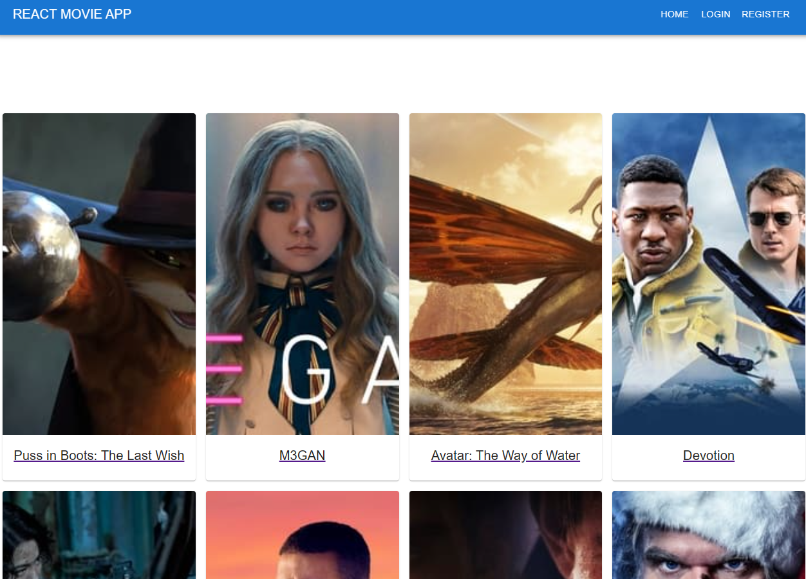
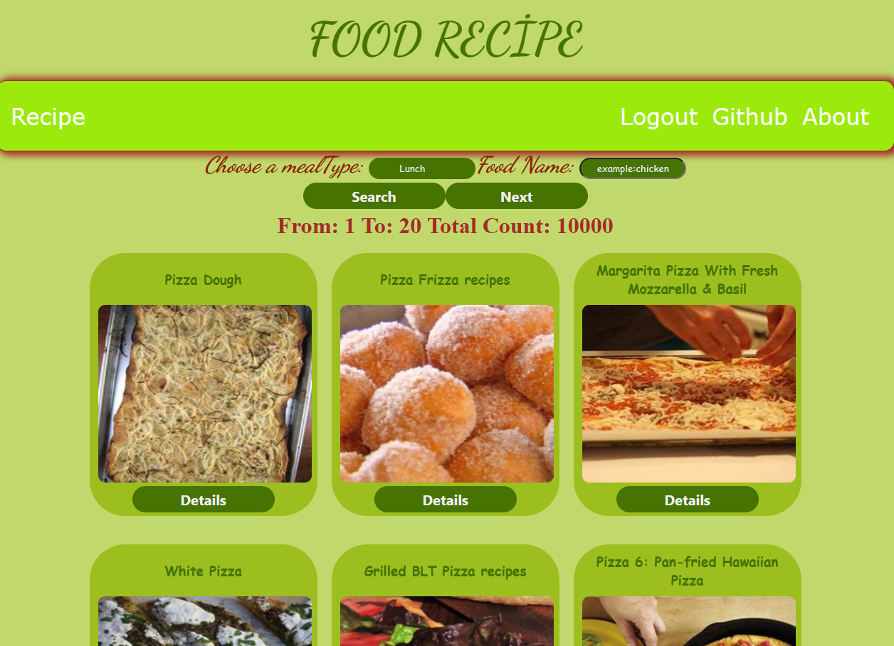
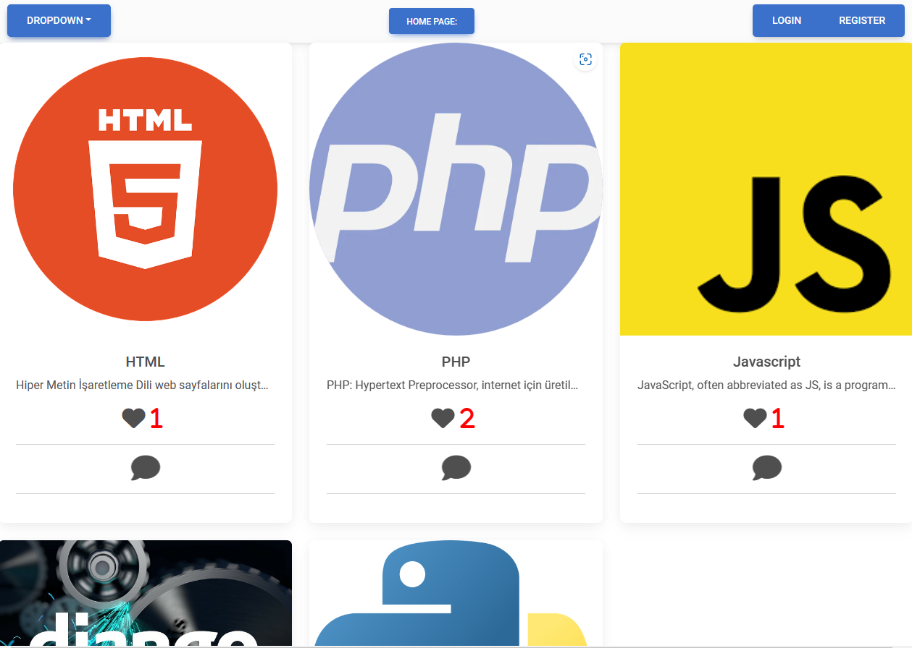

### Hi there 👋

<h1 align="center"> I'm a Full Stack Developer 🚀!</h1>  

<b> 🔭 I'm currently looking a good chance as Front-end Developer🌱 </b>  
<b>🌱 I'm currently learning</b> 😂  
<b>👯 I'm looking to collaborate with other React Native and Flutter developer 👩‍💻 and mobile app designers </b>🎨  
<b>🤔 I'm looking for help with Flutter front-end developer</b>  
<b>🥅 2023 Goals: Developing an app to be heard in the world 🌎 and learning backend and frontend </b>🤖  
<b>⚡ Fun fact: I love to swim 🏊‍♀️, play chess ♟, play basketball 🏀 and cycling </b>🚴‍♀️  

<!-- ///////////////////////////* -->

   
  
  
  
   

 
 
  

